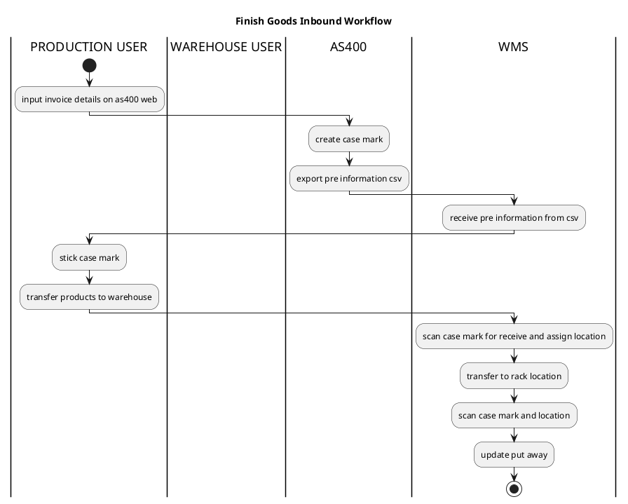

# Initial project

- npm init -y

# setup library

- npm install sequelize
- npm install express
- npm install cors
- npm install bcrypt
- npm install tedious
- npm install dotenv
- npm install supertest //unit test
- npm install jest // unit test
- npm install express-oas-generator //swagger api document
- npm install joi // validator
- npm install -g nodemon 
- npm install jsonwebtoken
# swagger

- http://localhost:3001/api-docs

//example create backend api with nodejs express for inventory system , design with oop

